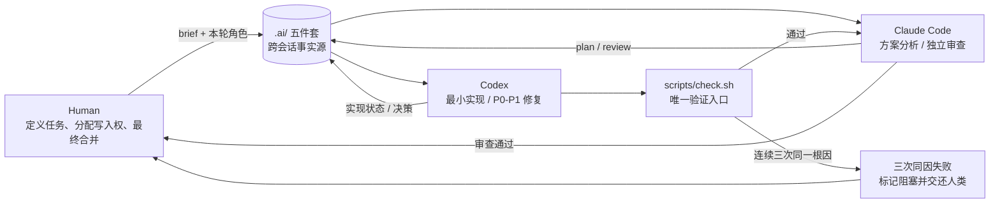

# Agent Workplace Init

[](skills/agent-workplace-init/SKILL.md)
[](LICENSE)

一个 SKILL.md 格式的 Agent Skill：一键在任意项目里搭建 **Codex + Claude
Code 双 Agent 协作工作流**——生成 `AGENTS.md` / `CLAUDE.md` /
`scripts/check.sh` / `.ai/` 交接文档结构，内置五条严格协作规则（单点写入、
文档驱动交接、单角色单轮、统一检查入口、三次同因失败熔断）以及双 agent 都要遵守的行动原则
（直接给建议不列菜单、最简方案、结论要有实证、只在必要时暂停、结论先行）。

同一份 SKILL.md 在 [Claude Code](https://code.claude.com/docs/en/skills) 和
Codex CLI 里都能原生识别和触发，不需要转换格式——你平时用 Codex 调用它，
或者用 Claude Code 调用它，效果完全一致。

```
project/
├── AGENTS.md            # 给 Codex 读
├── CLAUDE.md             # 给 Claude Code 读
├── scripts/
│   └── check.sh          # 统一验证入口
├── .ai/
│   ├── brief.md           # 当前任务说明
│   ├── plan.md            # 设计方案
│   ├── review.md          # 审查意见（P0/P1/P2）
│   ├── backlog.md         # 额外发现的问题
│   ├── decision-log.md    # 决策记录
│   └── prompts-examples.md
└── src/
```

## 协作架构



`.ai/` 是共享状态，不是共享写入权：任一时刻仍然只有一个 Agent 可以改文件。
典型闭环是 **分析 → 实现 → 统一检查 → 独立审查 → 定向修复 → 人工合并**。

## 一行安装

推荐用 skills CLI 一次安装到 Codex 和 Claude Code 的用户级目录：

```bash
npx skills add zosea231/agent-workplace-init --skill agent-workplace-init --agent codex claude-code -g -y
```

使用 GitHub CLI（`gh skill` 目前为 preview）时，按目标 Agent 安装：

```bash
# Codex
gh skill install zosea231/agent-workplace-init agent-workplace-init --agent codex --scope user

# Claude Code
gh skill install zosea231/agent-workplace-init agent-workplace-init --agent claude-code --scope user
```

装完可直接对 Agent 说：

```text
使用 $agent-workplace-init 为当前项目初始化 Codex + Claude Code 单写入协作工作区。
```

### 手动安装（fallback）

下载或克隆本仓库后，把 `skills/agent-workplace-init/` 复制到目标 Agent 的
用户级技能目录，确保最终路径是：

```text
~/.codex/skills/agent-workplace-init/SKILL.md   ✅ 正确
~/.claude/skills/agent-workplace-init/SKILL.md ✅ 正确
```

安装完成后，**重启 Codex CLI / Claude Code**（或开一个新会话）。Codex 可以
用 `/skills` 查看已识别的 skill 列表进行确认。

## 使用

安装好之后，直接在对话里说明意图即可，不需要记住任何命令，例如：

> "帮我在这个项目里搭建 Codex + Claude Code 的双 agent 协作工作流"
> "给这个仓库初始化 AGENTS.md / CLAUDE.md 和 .ai 目录"
> "我想让两个 agent 协作开发但不要互相踩踏，怎么设置"

Codex / Claude Code 会自动识别到这个 skill 并调用内置脚本完成一键搭建。也
可以手动直接运行（换成你实际安装的路径）：

```bash
# 如果装在 Codex
bash ~/.codex/skills/agent-workplace-init/scripts/init_workflow.sh /path/to/your/project

# 如果装在 Claude Code
bash ~/.claude/skills/agent-workplace-init/scripts/init_workflow.sh /path/to/your/project
```

脚本对已存在的文件不会覆盖，可以放心在老项目上重复运行来补齐缺失文件。

## 更新

```bash
# Codex
cd ~/.codex/skills/agent-workplace-init && git pull

# Claude Code
cd ~/.claude/skills/agent-workplace-init && git pull
```

## 目录结构（本仓库自身）

```
agent-workplace-init/
├── .ai/                        # 本仓库自身的任务状态与交接记录
├── .gitattributes              # 固定脚本与文档的跨平台换行规则
├── .gitignore                  # 排除生成 ZIP 和本地临时文件
├── AGENTS.md                   # Codex 在本仓库内的协作规则
├── CLAUDE.md                   # Claude Code 在本仓库内的协作规则
├── LICENSE
├── README.md
├── scripts/
│   └── check.sh                # 本仓库自己的唯一验证入口
└── skills/
    └── agent-workplace-init/   # 可被 npx skills / gh skill 发现的 Skill
        ├── SKILL.md
        ├── agents/openai.yaml
        ├── scripts/init_workflow.sh
        ├── references/rules.md
        └── assets/             # 会被复制到目标项目里的模板文件
```

## License

MIT
