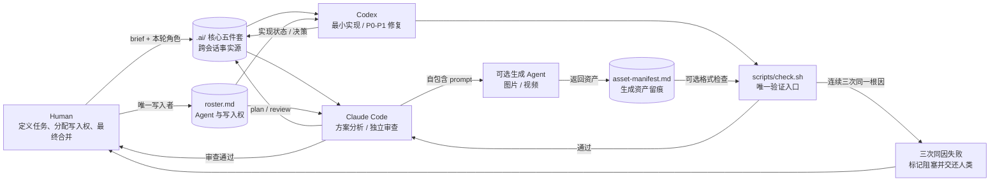

# AWI · Agent Workplace Init

[](skills/agent-workplace-init/SKILL.md)
[](LICENSE)

> 给多个 AI Agent 一套不会互相踩踏的工作协议。

**AWI** 是品牌简称；正式名称、仓库名和 Skill ID 仍分别是
**Agent Workplace Init**、`agent-workplace-init` 和 `agent-workplace-init`。

一个 SKILL.md 格式的 Agent Skill：一键在任意项目里搭建默认的 **Codex +
Claude Code 双 Agent 协作工作流**，并可按需接入图片、视频或其他专用 Agent。
它生成 `AGENTS.md` / `CLAUDE.md` / `scripts/check.sh` / `.ai/` 交接文档结构，
内置五条严格协作规则（单点写入、文档驱动交接、单角色单轮、统一检查入口、
三次同因失败熔断）以及所有 Agent 都要遵守的行动原则（直接给建议不列菜单、
最简方案、结论要有实证、只在必要时暂停、结论先行）。

同一份 SKILL.md 在 [Claude Code](https://code.claude.com/docs/en/skills) 和
Codex CLI 里都能原生识别和触发，不需要转换格式——你平时用 Codex 调用它，
或者用 Claude Code 调用它，效果完全一致。

```
project/
├── AGENTS.md            # 给 Codex 读
├── CLAUDE.md             # 给 Claude Code 读
├── scripts/
│   └── check.sh          # 统一验证入口
├── .ai/
│   ├── brief.md           # 当前任务说明
│   ├── plan.md            # 设计方案
│   ├── review.md          # 审查意见（P0/P1/P2）
│   ├── backlog.md         # 额外发现的问题
│   ├── decision-log.md    # 决策记录
│   ├── prompts-examples.md
│   ├── roster.md          # Agent 花名册与当前唯一写入者
│   └── asset-manifest.md  # 生成资产的完整 prompt 与验收状态
```

## 协作架构



`.ai/` 是共享状态，不是共享写入权：任一时刻仍然只有 `.ai/roster.md` 指定的
一个 Agent 拥有逻辑写入权。默认闭环仍是 **分析 → 实现 → 统一检查 → 独立审查
→ 定向修复 → 人工合并**；不登记新 Agent 时，行为与原双 Agent 工作流一致。

## 一行安装

在终端运行，或让 Agent 执行下面这条命令。它会安装到共享目录，并连接到
Codex 和 Claude Code：

```bash
npx skills add zosea231/agent-workplace-init --skill agent-workplace-init --agent codex claude-code -g -y
```

首次安装若看到 `GitHub rate limit reached — using your gh login to continue`，
这是 `npx skills` 在未设置 `GITHUB_TOKEN` 时的限流提示，不是本 Skill 出错；
设置 `GITHUB_TOKEN` 或保持 `gh` 已登录即可继续。

安装完成后，重启对应 Agent 或新开一个会话，然后直接说：

```text
为当前项目初始化 Codex + Claude Code 单写入协作工作区。
```

## 使用

安装好之后，直接在对话里说明意图即可，不需要记住任何命令，例如：

> "用 AWI 为当前项目初始化多 Agent 协作工作区"
> "帮我在这个项目里搭建 Codex + Claude Code 的双 agent 协作工作流"
> "给这个仓库初始化 AGENTS.md / CLAUDE.md 和 .ai 目录"
> "我想让两个 agent 协作开发但不要互相踩踏，怎么设置"

Codex / Claude Code 可以根据这个意图调用 Skill，并用内置脚本完成搭建。已有
文件不会被覆盖，可以在老项目上重复运行来补齐缺失文件。

`AWI` 是跨 runtime 的自然语言简称，显式 Skill ID 仍是
`agent-workplace-init`。若宿主支持本地命令别名，可把 `/awi` 映射到该 ID；
仓库本身不复制第二份 Skill，也不声明当前通用 Skill 格式并不支持的 alias 字段。

## 可选：接入生成式 Agent

在 `.ai/roster.md` 增加一行并填写 `generate-image` 或 `generate-video` 能力，
即可把图片 / 视频模型接入现有交接链。不能读取本地文件的 Agent 标为
`File access: no`：文件型 Agent 负责整理自包含 prompt，生成完成后把文件放到
`assets/generated/`，并把完整 prompt、输出路径和验收状态登记到
`.ai/asset-manifest.md`。

内容质量仍由人工或审查 Agent 验收。若项目提供 `scripts/checks/assets.sh`，统一
入口 `scripts/check.sh` 会自动调用它检查文件存在性、格式、尺寸或时长；它不判断
图片是否好看、视频内容是否正确。

## 目录结构（本仓库自身）

```
agent-workplace-init/
├── .ai/                        # 本仓库自身的任务状态与交接记录
├── .gitattributes              # 固定脚本与文档的跨平台换行规则
├── .gitignore                  # 排除生成 ZIP 和本地临时文件
├── AGENTS.md                   # Codex 在本仓库内的协作规则
├── CLAUDE.md                   # Claude Code 在本仓库内的协作规则
├── LICENSE
├── README.md
├── scripts/
│   └── check.sh                # 本仓库自己的唯一验证入口
└── skills/
    └── agent-workplace-init/   # 可安装的 Skill 包
        ├── SKILL.md
        ├── agents/
        │   └── openai.yaml     # Codex 展示元数据与默认提示词
        ├── assets/             # 只包含会写入目标项目的模板
        │   ├── AGENTS.md
        │   ├── CLAUDE.md
        │   ├── scripts/
        │   │   └── check.sh
        │   └── ai-templates/
        │       ├── brief.md
        │       ├── plan.md
        │       ├── review.md
        │       ├── backlog.md
        │       ├── decision-log.md
        │       ├── prompts-examples.md
        │       ├── roster.md
        │       └── asset-manifest.md
        ├── references/
        │   └── rules.md        # 协作规则的设计依据与边界说明
        └── scripts/
            └── init_workflow.sh
```

根目录的 `AGENTS.md`、`CLAUDE.md` 和 `.ai/` 是本仓库使用自身 Skill 的
工作副本，两个规则文件顶部也标明了这一点；
`skills/agent-workplace-init/assets/` 中的同名文件才是安装到目标项目的模板源。
两层文件用途不同，`scripts/check.sh` 会忽略自举提示后校验正文保持同步，并要求
提交到仓库的 `.ai/` 文件恢复为干净的初始模板。

## License

MIT
