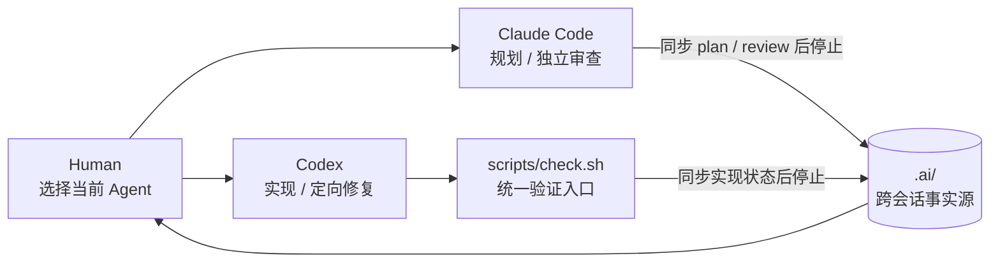

# Jiaojie

[](skills/jiaojie/SKILL.md)
[](LICENSE)

> 让不同 Agent 在零对话上下文下，仍能依靠文档完成清晰交接。

**Jiaojie** 是一个 SKILL.md 格式的 Agent Skill。它为项目建立默认的
**Codex + Claude Code** 协作工作流，并可按需接入图片、视频或其他专用
Agent。Skill ID、安装目录和显式调用名均为 `jiaojie`。

它生成：

- `AGENTS.md` 与 `CLAUDE.md`：两类 Agent 共同遵守的项目规则；
- `.ai/`：目标、方案、审查、待办、决策、花名册和资产记录；
- `references/sync-rules.md`：让下一位 Agent 从零上下文读懂当前状态的同步规则；
- `scripts/check.sh`：代码和资产修改后的统一验证入口。

交接由人类手动编排，不使用锁、Hook 或写入权字段。当前 Agent 在阶段结束时把
结论同步到 `.ai/`，停止工作；人类再切换到下一位 Agent。

## 一行安装

仓库名和 Skill ID 均为 `jiaojie`：

```bash
npx skills add zosea231/jiaojie --skill jiaojie --agent codex claude-code -g -y
```

本项目刻意只维护这一条标准 Skill 安装通道，不提供
`.claude-plugin/marketplace.json` 或 `plugins/jiaojie/` 镜像，避免两份包结构
长期漂移。

安装后重启对应 Agent 或新开会话，然后直接说：

```text
用 jiaojie 为当前项目初始化 Codex + Claude Code 交接工作区。
```

支持显式调用的宿主也可以使用 `$jiaojie`。

## 工作流



默认闭环：

1. Claude Code 读取 `.ai/`，规划并同步 `.ai/plan.md`，然后停止；
2. 人类切换到 Codex；
3. Codex 读取 `.ai/`，按方案实现并运行 `scripts/check.sh`，同步状态后停止；
4. 人类切换到 Claude Code；
5. Claude Code 独立审查，把 P0/P1/P2 写入 `.ai/review.md`，同步后停止；
6. 人类决定切回 Codex 定向修复，或进入人工合并。

当用户明确说“同步进度到交接文档”“更新交接文档”或
“sync progress to the handoff docs”时，Agent 会立即按
`references/sync-rules.md` 将信息路由到正确文件，而不是输出对话流水账。

## 生成的项目结构

```text
project/
├── AGENTS.md
├── CLAUDE.md
├── references/
│   └── sync-rules.md
├── scripts/
│   └── check.sh
└── .ai/
    ├── brief.md
    ├── plan.md
    ├── review.md
    ├── backlog.md
    ├── decision-log.md
    ├── prompts-examples.md
    ├── roster.md
    └── asset-manifest.md
```

已有文件不会被覆盖，因此可以在现有项目中重复运行初始化脚本以补齐缺失文件。
`.ai/roster.md` 只登记 Agent、模型、能力、文件访问和状态，不承担锁或调度功能。

## 可选：接入图片或视频 Agent

在 `.ai/roster.md` 增加一行并填写 `generate-image` 或
`generate-video` 能力。不能读取项目文件的 Agent 由文件型 Agent 为其准备
自包含 prompt；生成后，人类切回文件型 Agent，将资产放入
`assets/generated/` 并把完整 prompt、路径和验收状态追加到
`.ai/asset-manifest.md`。

内容质量由人类或独立审查 Agent 判断。若项目提供
`scripts/checks/assets.sh`，统一入口只检查存在性、格式、尺寸或时长。

## 仓库结构

```text
jiaojie/
├── .ai/                         # 仓库自身的干净交接模板
├── AGENTS.md                    # 仓库自用规则副本
├── CLAUDE.md                    # 仓库自用规则副本
├── references/
│   └── sync-rules.md
├── scripts/
│   └── check.sh                 # 仓库验证入口
└── skills/
    └── jiaojie/                 # 可安装的 Skill 包
        ├── SKILL.md
        ├── agents/openai.yaml
        ├── assets/
        ├── references/
        └── scripts/init_workflow.sh
```

根目录的自用规则和 `.ai/` 模板会由 `scripts/check.sh` 与
`skills/jiaojie/assets/` 对账，防止仓库说明与实际安装产物漂移。

## License

MIT
